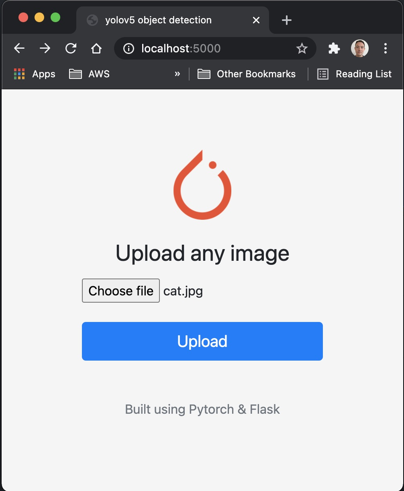

# 나는야 분리수거를 잘하는 어린이 재활용품 객체인식 Yolov5 api using flask🔥
본 Recycle_api는 https://github.com/robmarkcole/yolov5-flask 를 참조하여 **나는야 분리수거를 잘하는 어린이 재활용품**에 필요한 형태로 수정하였다.

POST 요청으로 재활용품 사진을 넣으면 객체인식 결과를 도출한다.
## restapi.py: 데이터 출력 형식 수정
**predict()함수**에 아래 코드 부분 수정
```
app = Flask(__name__)
DETECTION_URL = "/v1/object-detection/Trash1"
   
DATETIME_FORMAT = "%Y-%m-%d_%H-%M-%S-%f"
@app.route(DETECTION_URL, methods=["POST"])
def predict():
    if not request.method == "POST":
        return

    if request.files.get("image"):
        image_file = request.files["image"]
        image_bytes = image_file.read()
        img = Image.open(io.BytesIO(image_bytes))
        
        
        temp = model(img, size=640) # reduce size=320 for faster inference

        # 이미지 크기 조절(화면에서 뽑기 위함(html 상에서))
        resized_image = img.resize((380, 506), Image.ANTIALIAS)


        results = model([resized_image]) #이미지 사이즈 조정
        picture=results.render()
        now_time = datetime.datetime.now().strftime(DATETIME_FORMAT)
        img_savename = f"/Users/jiwon/Desktop/zolup5/src/main/resources/yolov5_img/{now_time}.png"

        #객체인식 결과 사진 파일 SpringSever에 저장
        Image.fromarray(results.ims[0]).save(img_savename)
        img_result=temp.pandas().xyxy[0].to_json()
        
        res={
            'result': img_result,   #결과값 Json 변환용
            'img':  img_savename,   #이미지 파일
        }
        return jsonify(res)
```

## Postman api 요청 test
<br>
               **glass.png**

<br>
                                    **Result**


## Reference: 
-https://github.com/robmarkcole/yolov5-flask(this repo was forked from here)

##

# Yolov5 object detection model deployment using flask
This repo contains example apps for exposing the [yolo5](https://github.com/ultralytics/yolov5) object detection model from [pytorch hub](https://pytorch.org/hub/ultralytics_yolov5/) via a [flask](https://flask.palletsprojects.com/en/1.1.x/) api/app.

## Web app
Simple app consisting of a form where you can upload an image, and see the inference result of the model in the browser. Run:

`$ python3 webapp.py --port 5000`

then visit [http://localhost:5000/](http://localhost:5000/) in your browser:

<p align="center">

</p>

<p align="center">

</p>

Processed images are saved in the `static` directory with a datetime for the filename.

## Rest API
Simple rest API exposing the model for consumption by another service. Run:

`$ python3 restapi.py --port 5000 --model yolov5s`

Then use [curl](https://curl.se/) to perform a request:

`$ curl -X POST -F image=@tests/zidane.jpg 'http://localhost:5000/v1/object-detection/yolov5'`

The model inference results are returned:

```
[{'class': 0,
  'confidence': 0.8197850585,
  'name': 'person',
  'xmax': 1159.1403808594,
  'xmin': 750.912902832,
  'ymax': 711.2583007812,
  'ymin': 44.0350036621},
 {'class': 0,
  'confidence': 0.5667674541,
  'name': 'person',
  'xmax': 1065.5523681641,
  'xmin': 116.0448303223,
  'ymax': 713.8904418945,
  'ymin': 198.4603881836},
 {'class': 27,
  'confidence': 0.5661227107,
  'name': 'tie',
  'xmax': 516.7975463867,
  'xmin': 416.6880187988,
  'ymax': 717.0524902344,
  'ymin': 429.2020568848}]
```

## Run & Develop locally
Run locally for dev, requirements mostly originate from [yolov5](https://github.com/ultralytics/yolov5/blob/master/requirements.txt):
* `python3 -m venv venv`
* `source venv/bin/activate`
* `(venv) $ pip install -r requirements.txt`
* `(venv) $ python3 restapi.py --port 5000`

An example python script to perform inference using [requests](https://docs.python-requests.org/en/master/) is given in `tests/test_request.py`

## Docker
The example dockerfile shows how to expose the rest API:
```
# Build
docker build -t yolov5-flask .
# Run
docker run -p 5000:5000 yolov5-flask:latest
```

## reference
- https://github.com/ultralytics/yolov5
- https://github.com/jzhang533/yolov5-flask (this repo was forked from here)
- https://github.com/avinassh/pytorch-flask-api-heroku
